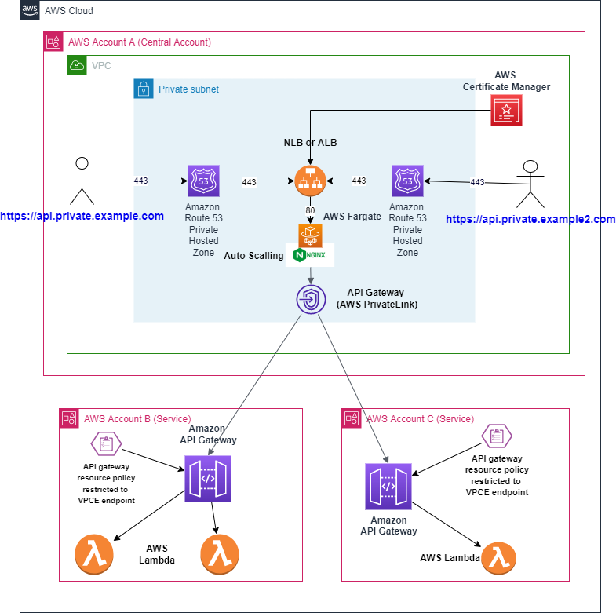
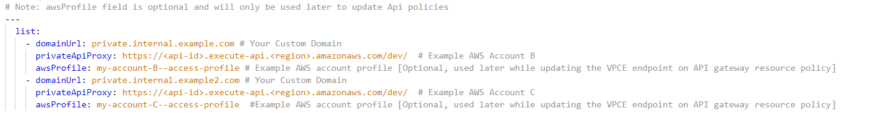

# Enabling Private APIs with Custom Domain Names with multi-domain and multi-account support using CDK (Cloud Development Kit)

This repository implements a feature-rich reverse proxy ingress layer, which supports requirements for enabling private API(s) with custom domain(s) with support for multi-account environment. This solution also supports a simple way to add/ update/ delete mapping between your custom domain(s) and their respective private API(s).

- [Enabling Private APIs with Custom Domain Names with multi-domain and multi-account support using CDK (Cloud Development Kit)](#enabling-private-apis-with-custom-domain-names-with-multi-domain-and-multi-account-support-using-cdk-cloud-development-kit)
  - [Services Used](#services-used)
  - [Architecture](#architecture)
  - [Traffic Flow](#traffic-flow)
  - [Solution Deployment](#solution-deployment)
    - [Requirements](#requirements)
    - [Proxy Configuration Set Up](#proxy-configuration-set-up)
    - [Deploy the Main solution](#deploy-the-main-solution)
      - [Deployment](#deployment)
      - [Networking Components](#networking-components)
      - [Rest of the Components](#rest-of-the-components)
    - [Update private API gateway policy with API Gateway VPCE Id](#update-private-api-gateway-policy-with-api-gateway-vpce-id)
    - [Update and deploy new mapping file/ Nginx configuration](#update-and-deploy-new-mapping-file-nginx-configuration)
    - [Testing the deployment](#testing-the-deployment)
    - [Clean Up](#clean-up)

## Services Used

- [AWS Certificate Manager](https://aws.amazon.com/certificate-manager/)
- [AWS Network Load Balancer](https://docs.aws.amazon.com/elasticloadbalancing/latest/network/introduction.html)
- [AWS Application Load Balancer](https://docs.aws.amazon.com/elasticloadbalancing/latest/application/introduction.html)
- [Amazon VPC Endpoints](https://docs.aws.amazon.com/vpc/latest/privatelink/vpc-endpoints.html)
- [Amazon Route 53](https://aws.amazon.com/route53/)
- [Amazon API Gateway](https://aws.amazon.com/api-gateway/)
- [AWS Fargate](https://aws.amazon.com/fargate/)
- [Amazon Elastic Container Registry](https://aws.amazon.com/ecr/)

## Architecture

The architecture diagram below illustrates the interactions between the components in the solution and leverages NLB (AWS Network Load Balancer ) or ALB (AWS Application Load Balancer) for routing traffic and AWS Fargate (ECS) for hosting the Nginx reverse proxy to map traffic between the custom domains and their respective private API Gateway endpoints.



## Traffic Flow

A user or application makes an API request to the fully qualified domain name (FQDN) of the custom domain name, in this example private.internal.example.com or private.internal.example2.com. We use respective private hosted zone(s) in association with the VPC. The CNAME resolves to the FQDN of the private load balancer. For more details, refer to the [documentation](https://docs.aws.amazon.com/Route53/latest/DeveloperGuide/hosted-zone-private-creating.html) on private hosted zones.
 The load balancer terminates TLS with the ACM certificate for respective custom domain. The listener redirects to associated target group. The target group of the load balancer is registered with ECS service for AWS Fargate. Fargate service hosts a Nginx-based container that acts as a reverse proxy to private API Gateway endpoints in service account(s). Fargate service is auto-scaled using a given target tracking metric. There is an YAML based mapping file deployed with application, which maintains the mapping between a custom domain and its respective private API endpoint.

## Solution Deployment

### Requirements

- [Node.js ≥ 16.15.1](https://nodejs.org/en/)
- [Git](https://git-scm.com/downloads)
- [Typescript >= 4.7.0](https://www.typescriptlang.org/download/)
- [AWS CLI](https://docs.aws.amazon.com/cli/latest/userguide/cli-chap-getting-started.html)
- [Docker CLI](https://docs.docker.com/get-docker/)
- [CDK (Cloud Development Kit)](https://docs.aws.amazon.com/cdk/v2/guide/getting_started.html#getting_started_install)

Start by deploying the CDK-based solution. During the deployment CDK app parses custom mapping file to find a list of custom domains and their corresponding private API endpoint and creates required resources in your AWS account(s).

Clone this repository and install dependencies:

```sh
git clone https://gitlab.aws.dev/sddoshi/enabling-custom-domain-names-for-private-api-gateway-endpoints.git

# cd into your cloned repository then, 
cd ./cdk
```

### Proxy Configuration Set Up

Open file ./config/proxy-config-template.yaml, ***rename this file to proxy-config.yaml***.
Take look at the YAML structure of the file, every time when would like to update your private api to custom domain mapping, you would need to update this file.
Details on properties of this yaml file.

- **domainUrl** : #Your Custom Domain e.g. api.example.com
- **privateApiProxy** : URL to your private API gateway endpoint , Solution supports adding API urls hosted in another AWS account as well.
- **awsProfile** : This is an optional field. You can set your AWS profile name on this field to update the VPCE endpoint across multiple accounts where private APIs are hosted. More details on this field will be followed later.


This file will be parsed by the CDK application to create Nginx configuration file.

### Deploy the Main solution

You can deploy the solution two ways.
You can use your existing VPC or create a new VPC with networking components part of the deployment.

**NOTE**: If you choose to use your existing VPC, your VPC should have components similar to mentioned [here](#networking-components) as requirement to proceed.

The solution has multiple options that can be provided at runtime or may be pre-specified using a an environment file.  To pre-specify options create a file using this template and specify your dev.env file during execution.

```sh

############################################ sample dev.env file start ####################################

create_vpc="true" # Set to false if you wish to use an existing VPC
external_vpc_id="vpc-0123456789" # Ignored if create_vpc = true
external_private_subnets_id='["subnet-abcdef01234","subnet-abcdef01234"]' # Ignored if create_vpc = true
app_environment="myenvironment"
app_name="myapp"
public_subnets_cidr='["10.0.0.0/19","10.0.32.0/19"]' # Must be within VPC CIDR
private_subnets_cidr='["10.0.64.0/19", "10.0.96.0/19"]' # Must be within VPC CIDR
vpc_cidr="10.0.0.0/16" # Any valid AWS VPC CIDR
elb_type="ALB" # Accepts ALB or NLB
task_image="public.ecr.aws/nginx/nginx:latest"

############################################ sample dev.env file start ####################################

```

#### Deployment

You can deploy the solution two ways.

1. Automated, provide information using a text file.

- Using your preferred text editor create a text file with the following content, providing environment values as appropriate:

    ```sh
    AWS_PROFILE='default'
    AWS_REGION='us-east-1'
    ACCOUNT_NUMBER='000000000000'
    APP_ENVIRONMENT='prod'
    APP_NAME='customApp'    
    ELB_TYPE='NLB'
    CREATE_VPC='true'
    VPC_CIDR='10.0.0.0/16' #ONLY REQUIRED IF CREATE_VPC="true"
    PUBLIC_SUBNETS_CIDR='["10.0.0.0/19","10.0.32.0/19"]' # ONLY REQUIRED IF CREATE_VPC="true"
    PRIVATE_SUBNETS_CIDR='["10.0.64.0/19","10.0.96.0/19"]' # ONLY REQUIRED IF CREATE_VPC="true"
    EXTERNAL_VPC_ID='vpc-0123456789' #ONLY REQUIRED IF CREATE_VPC="false"
    EXTERNAL_PRIVATE_SUBNETS_ID='["subnet-01234567890abdcdef","subnet-01234567890abdcdef"]' # ONLY REQUIRED IF CREATE_VPC="false"
    EXTERNAL_ALB_SG_ID='sg-0123456789' # ONLY REQUIRED IF CREATE_VPC="false" and ELB_TYPE="ALB"
    
    TASK_IMAGE='public.ecr.aws/nginx/nginx:latest' # ??????????????? TODO

    ```

  - Execute the script in a terminal."

    ```sh
    chmod +x ./exec.sh
    ./exec.sh -f <path to environment file>
    ```

2.Interactive, provide information using via the deployment script.

- Execute the script in a terminal.

    ```sh
    chmod +x ./exec.sh
    ./exec.sh
    ```

This CDK will create the following components and services in your AWS Account

#### Networking Components

- VPC with given CIDR
- Public and Private Subnet in 2 Availability Zones
- A security group with rules for your Application load balancer ALB_SG, with the following rules
  - Ingress on TCP 443 on local from all of VPC CIDR
  - Egress allowed Fargate Security Group FARGATE_SG
- A security group with rules for your Fargate ECS service FARGATE_SG (Which will host Nginx proxy)
  - IF you chose ELB_TYPE as ALB (Application Load Balancer)
    - Allow Ingress from ALB_SG
    - Allow Egress outbound all ports/ destinations
  - IF you chose ELB_TYPE as NLB (Network Load Balancer)  
    - Ingress on TCP 80 from all VPC private subnets
    - Allow Egress outbound all ports/ destinations
- Private links endpoints for following services
  - Interface endpoint for API Gateway
  - Interface endpoint for ECR API
  - Interface endpoint for ECR Registry
  - Interface endpoint for Logs
  - Gateway endpoint for S3

#### Rest of the Components  

- Respective Amazon Route53 private hosted zones, this is based on unique domains found in proxy-config.yaml file.  
- An Application Load Balancer or Network Load balancer, in your given VPC private subnet.
- ACM certificates for SSL offloading on ELB (Elastic Load Balancer), this is based on domains found in proxy-config.yaml file.\
  **Note**: Creation of SSL certificate for domains in mapping file requires validation with a Route 53 hosted zone. To automate the validation while deploying of the mapping file we have chosen DNS based validation of SSL certificates with the Route 53 **public hosted zone**. A Public hosted zone in Route53 needs to be present for top level domain(e.g. if you have a domain private.internal.example.com in your mapping file then a top level domain example.com should be a public hosted zone present in your account to child domains with validate SSL certificates in ACM)
- DNS of ELB would be added as alias record set in respective private Route53 private hosted zones.
- CDK parses proxy-config.yaml file, and creates Nginx configuration file.
- CDK creates a Docker image of Nginx Server and uploads it ECR.
- Finally CDK deployment creates an auto scaled Fargate service, and downloads Nginx image (Hosting Nginx as a reverse proxy to private API gateway endpoints).  

Note: Initial CDK deployment could take approximately 10 - 15 minutes to deploy.

### Update private API gateway policy with API Gateway VPCE Id

There are multiple ways in which you can update API gateway resource policy with VPCE endpoint.

- Update manually API Gateway Endpoint Policy.
  - Find the API Gateway Endpoint policy Id (VPCE ID) and manually add it to your private API gateway resource policy.[Check detail documentation here](https://docs.aws.amazon.com/apigateway/latest/developerguide/apigateway-vpc-endpoint-policies.html)
  - Remember to deploy the API after the update.
- Update API Gateway Endpoint policy using provided scripts.
  - There are two ways to update the VPCE Id to your Apis
    - Option 1: Update single API Gateway resource policy and deploy the API. Find the VPCE Endpoint ID of API Gateway. Run the script below as shown below.

      ```sh

      export AWS_ACCESS_KEY_ID="<aws_access_key_id>" # AWS AWS_ACCESS_KEY_ID of account in which you plan to update API resource policy.
      export AWS_SECRET_ACCESS_KEY="<aws_secret_access_key>" # AWS AWS_SECRET_ACCESS_KEY of account in which you plan to update API resource policy.
      export AWS_REGION="<region>"      #AWS Region      
      export API_GATEWAY_VPCE_ENDPOINT_ID="<your_api_gateway_vpce_id>" # You can find your API gateway VPCE id in **vpc-with-endpoints** cdk_outputs.json, if you are using your VPC, copy the VPCE id from your AWS account console.
      export PRIVATE_API_ID="<my-api-id>" # ID of the API to update, example API https://my-api-id.execute-api.<region>.amazonaws.com/dev/ 

      npm install
      ts-node ./scripts/update-api-policy.ts --private_api_gateway_id "${PRIVATE_API_ID}" --api_gateway_vpce_endpoint_id "${API_GATEWAY_VPCE_ENDPOINT_ID}" --region "${AWS_REGION}" 
      
      ```

    - Option 2: Update multiple APIs across all your AWS accounts. You will have to provide an AWS Profile for each API Gateway in proxy-config.yaml for their respective accounts. Run the script as shown below, this script uses proxy-service/proxy-config.yaml to find the respective items, and their account profiles to update to Api resource policy and deploy the API. You can create an AWS account profile using[guidelines](https://docs.aws.amazon.com/toolkit-for-visual-studio/latest/user-guide/keys-profiles-credentials.html).
  
      ```sh

      API_GATEWAY_VPCE_ENDPOINT_ID="<your_api_gateway_vpce_id>" # You can find you Api gateway VPCE id in **vpc-with-endpoints** cdk_outputs.json, if you are using your own VPC, copy the VPCE id from your AWS account console.     

      npm install
      ts-node ./scripts/update-api-policy.ts --api_gateway_vpce_endpoint_id "${API_GATEWAY_VPCE_ENDPOINT_ID}" --region "${AWS_REGION}" 
      
      ```

### Update and deploy new mapping file/ Nginx configuration

Update the proxy-service/proxy-config.yaml
  Deploy the CDK app again [similar to](#deploy-the-main-solution), this action should deploy the CDK application with an updated container image and deploy to the Fargate service. There is also a circuit breaker in place, which might be triggered if the deployment is unsuccessful and the circuit breaker will "roll back" to the last successful deployment  
  
### Testing the deployment

You can test your CDK deployment, using EC2 AMI in the same VPC in a public subnet. SSH into your EC2. Then run following command.

```sh
# Curl to one of your private custom domain present in your proxy-config.yaml file.
curl https://internal.example.com
```

### Clean Up

```sh
cd ./proxy-service
npm run destroy

# optional , if you created VPC using the CDK stack
cd ..
 
cd ./vpc-with-endpoints
npm run destroy

```

## Security

See [CONTRIBUTING](CONTRIBUTING.md#security-issue-notifications) for more information.

## License

This library is licensed under the MIT-0 License. See the LICENSE file.